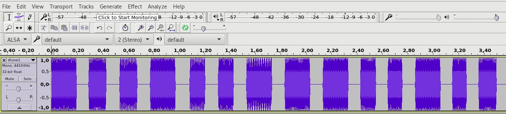

Author: doubleloop (Jakub Łuczyński)

# DTUNE

CTF: BackdoorCTF 2016  
Link: https://backdoor.sdslabs.co/challenges/DTUNE  
Author: Vishrut Kumar Mishra  
Points: 70  
Category: forensic, sound


Description
-----------

>   Vector recorded this audio when Gill Bates was opening his/her vault
>   and Gru stole this recording from him (stealing from a thief ain't
>   a crime, right?). Help Gru decode this message so that he can
>   ...(Use your imagination)
>
>   Clue:
>   Message consists of upcase letters.

[recording](resources/dtune1.flac)


tl;dr
-----

The provided file consists of a recorded touch-tone dialing sequence
(DTMF format). After decoding, one needs to map key presses to letters
(old style, with physical keyboard, SMS texting).


Solution
--------

After listening to the sound, it was clear that it was a touch-tone
dialing sequence, or more technically -
[DMTF](https://en.wikipedia.org/wiki/Dual-tone_multi-frequency_signaling).
In short - it was an encoded sequence of digits.

With [this](http://dialabc.com/sound/detect/) on-line tool we found
we have decoded the digits:
```python
numbers = [8, 4, 3, 0, 3, 5, 2, 4, 0, 4, 7, 7, 0, 7, 4, 4, 2, 2,
           *, * ,* ,* ,* ,* ,* ,* ,* ,* ,* ,* ,* ,* ,* ,* ,* ,* ]

```

One of the ideas we came up with was a DTMF encoded session of old-style
SMS writing.


We've created this mapping:
```python
string_map = {
   0: ' ',
   2: 'abc',
   3: 'def',
   4: 'ghi',
   5: 'jkl',
   6: 'mno',
   7: 'pqrs',
   8: 'tuv',
   9: 'wxyz',
}
```

Still there was one problem. By listening to the sound we could clearly
distinguish that the tones were grouped. The same tones (repetitions of
a single digit) were separated with short intervals. We observed that
the tool we had been using might have had problems with those short
separators, so we have (manually, using Audacity) counted the repetitions
and merged them into single digits.




[modified file](resources/dtune2.flac)

These are the repetitions we have counted:
```python
rep = [1, 2, 2, 1, 3, 3, 1, 1, 1, 3, 4, 1, 4, 2, 1, 1, 1, 1, 1, 3, 3,
       *, *, *, *, *, *, *, *, *, *, *, *, *]
```
and this is the updated file decoded:
```python
nums = [8, 4, 3, 0, 3, 5, 2, 4, 0, 4, 7, 0, 7, 4, 2, 2, 5, 6, 0, 6,
        *, *, *, *, *, *, *, *, *, *, *, *, *, *]
```

Finally, after zipping the lists and decoding the message with:
```python
out = ''
for n, r in zip(nums, rep):
   out+= string_map[n][r - 1]
print out
```
we ended up with the following string: `the flag is shaajm of x CENSORED x.`
It was pretty easy to notice that `shaajm` in the decoded string is actually
`sha256`.
