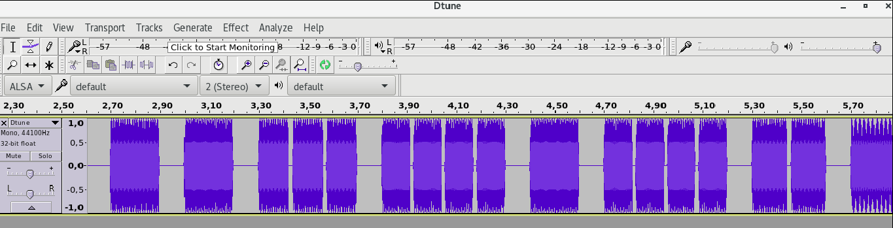
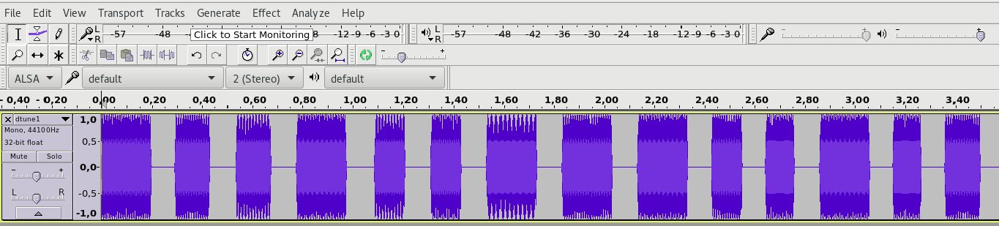

Author: doubleloop (Jakub Łuczyński)

# Task: dTune

CTF: Backdoorctf16  
Link: https://backdoor.sdslabs.co/challenges/DTUNE  
Author: Vishrut Kumar Mishra  
Points: 70  
Category: Misc  
Description:
>Vector recorded this audio when Gill Bates was opening his/her vault and Gru stole this recording from him (stealing from a thief ain't a crime, right?). Help Gru decode this message so that he can ...(Use your imagination)

[link to wav file](dtune1.wav)

Clue:
>Message consists of upcase letters.

## TL;DR

Provided file contains recording of tones in DTMF format. It is possible to decode it
with help of some online tools and some sound editing program (like Audacious)


## Solution

After listening the sound, it was clear that it contains telephone sounds.
Couple minutes of googling and we found the description of DTMF -
[Dual-tone multi-frequency](https://en.wikipedia.org/wiki/Dual-tone_multi-frequency_signaling).

In short, every frequency is mapped to some digit. We were lazy so we searched for some tool for retrieving the digits which would work out of the box. one of them was [on-line tool](http://dialabc.com/sound/detect/) . We just uploaded sound file and BAM, we have some digits.

```python
numbers = [8, 4, 3, 0, 3, 5, 2, 4, 0, 4, 7, 7, 0, 7, 4, 4, 2, 2,
           *, * ,* ,* ,* ,* ,* ,* ,* ,* ,* ,* ,* ,* ,* ,* ,* ,* ]

```

Now the question was how to retrieve SHA from this.. From the clue we know the message consists of capital letters. One of our first idea was the coding of the cell phone keyboard. Remember those times before smart-phones when you typed SMS by pressing digits multiple times? Using some simple image from Internet like:


we could write simple mapping:

```python
string_map = {
   0: ' ',
   2: 'abc',
   3: 'def',
   4: 'ghi',
   5: 'jkl',
   6: 'mno',
   7: 'pqrs',
   8: 'tuv',
   9: 'wxyz',
}
```

Still there was one problem. By listening to the sound we could clearly distinguish that the tones are grouped. Small intervals where separating the same tone (so it had to be repetition of one digit). I was not sure how the on-line tool treated the repeated sounds so I opened the file in Audacity and counted chunks (manually).




There were 34 vs 36 that I got from the on-line tool.. Hmm, it probably required tones to be in the same intervals and it failed on our sample. So I manually removed all repetitions using Audacity (manual select/remove) and also note down number of repetitions of each sound. I got modified file:


[Updated wav file](dtune1.wav)

and numbers of repetitions:
```python
rep = [1, 2, 2, 1, 3, 3, 1, 1, 1, 3, 4, 1, 4, 2, 1, 1, 1, 1, 1, 3, 3,
       *, *, *, *, *, *, *, *, *, *, *, *, *]
```

After uploading modified file i got new array of numbers:
```python
nums = [8, 4, 3, 0, 3, 5, 2, 4, 0, 4, 7, 0, 7, 4, 2, 2, 5, 6, 0, 6,
        *, *, *, *, *, *, *, *, *, *, *, *, *, *]
```

Now the lengths are OK! Finally some python loop to get the letters:
```python
out = ''
for n, r in zip(nums, rep):
   out+= string_map[n][r - 1]

print out
# the flag is shaajm of ************.
```

At first we tried:
```python
hashlib.sha256('SHAAJM OF ************').hexdigest()
```

Then after few trials ('with spaces, without spaces'), we noticed:
```python
# shaajm -> sha256

print hashlib.sha256('************').hexdigest()
```
which gave the solution.
